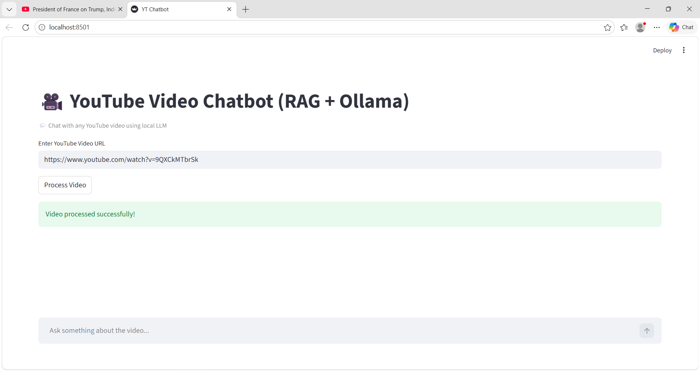
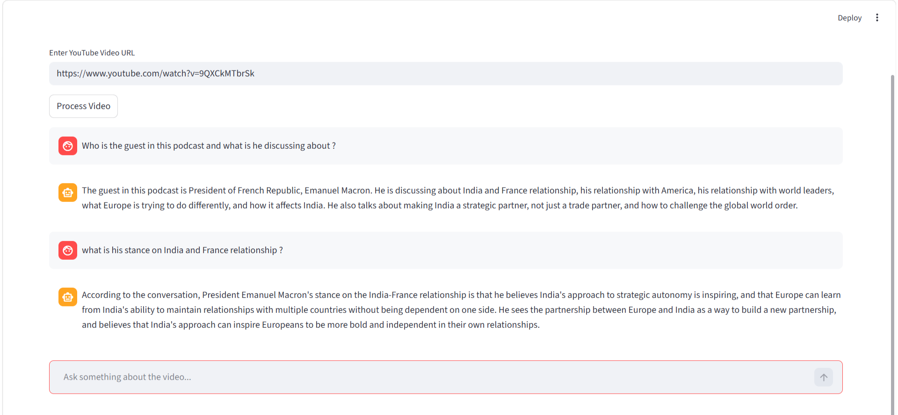
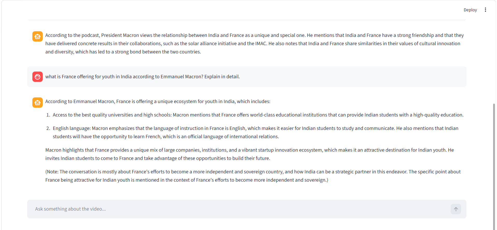
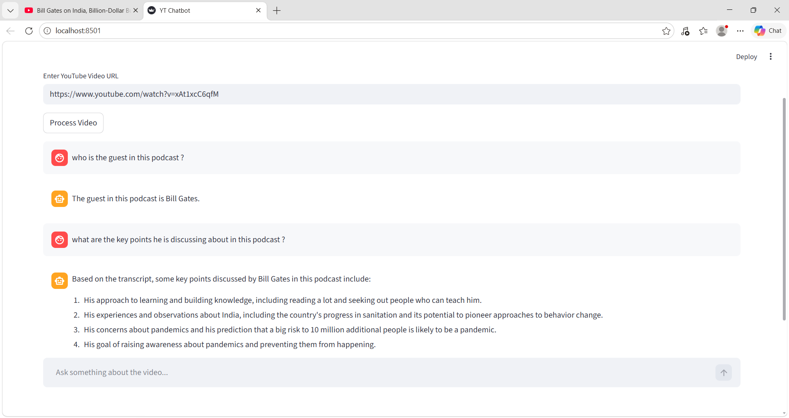
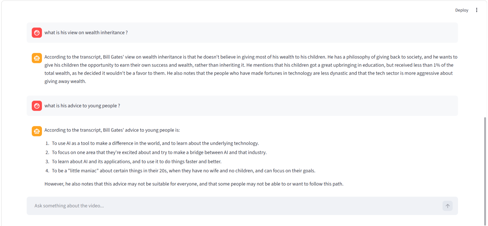

# 🎥 YouTube Video Chatbot (RAG + Ollama)

A conversational AI chatbot that allows users to interact with any YouTube video by asking questions about its content. The system extracts transcripts, performs semantic search using vector embeddings, and generates context-aware responses using a local LLM.

---

## 🚀 Features

- 🔗 Input any YouTube video URL  
- 📄 Automatic transcript extraction  
- 🧠 Retrieval-Augmented Generation (RAG)  
- 💬 Chat-based interface with memory (last 8 messages)  
- ⚡ Streaming responses (real-time output)  
- 🏠 Fully local (no OpenAI API required)  

---

## 🧠 Tech Stack

- **LangChain** – RAG pipeline & orchestration  
- **Ollama (Llama3)** – Local LLM for generation
- **nomic-embed-text** - Embedding Model
- **ChromaDB** – Vector database (in-memory)  
- **YouTube Transcript API** – Data extraction  
- **Streamlit** – Frontend UI  

---

## 📂 Project Structure

```

YT-Video-Chatbot-RAG/
│
├── examples/               # Screenshots & demo video
│   ├── Start.png
│   ├── Video1_1.png
│   ├── Video1_2.png
│   ├── Video2_1.png
│   ├── Video2_2.png
│   └── Yt_Chatbot.gif
│
├── src/
│   ├── transcript.py       # Extracts YouTube transcript
│   ├── vector_store.py     # Chunking + embeddings + vector DB
│   ├── rag_chain.py        # RAG pipeline (chat + streaming)
│
├── app.py                  # Streamlit UI (chat interface)
├── main.py                 # Backend orchestration
├── yt_rag_chatbot.py       # Initial prototype (legacy)
├── requirements.txt
└── README.md

````

---

## ⚙️ How It Works

1. User inputs a YouTube URL  
2. Transcript is extracted using YouTube Transcript API  
3. Text is split into chunks  
4. Embeddings are generated using `nomic-embed-text`  
5. Stored in ChromaDB (vector store)  
6. User asks a question  
7. Relevant chunks are retrieved  
8. LLM (Llama3 via Ollama) generates contextual answer  
9. Response is streamed in real-time  

---

## 📸 Application Preview

### 🔹 Initial Interface



---

### 🎥 Demo Video

[▶️ Watch Demo](examples/Yt_Chatbot.gif)

---

### 🔹 Video 1 Example

🔗 Example Video 1 Link:  
https://www.youtube.com/watch?v=9QXCkMTbrSk

<p align="center">
  
  
</p>

---

### 🔹 Video 2 Example

🔗 Example Video 2 Link:  
https://www.youtube.com/watch?v=xAt1xcC6qfM

<p align="center">
  
  
</p>

---

## 🛠️ Setup & Installation

### 1️⃣ Install Ollama

Download and install from:  
https://ollama.com  

---

### 2️⃣ Pull Required Models

```bash
ollama pull llama3
ollama pull nomic-embed-text
````

---

### 3️⃣ Install Dependencies

```bash
pip install -r requirements.txt
```

---

### 4️⃣ Run the Application

```bash
streamlit run app.py
```

---

## 🎯 Key Highlights

* Implemented conversational RAG using `MessagesPlaceholder`
* Integrated streaming responses for better UX
* Designed modular architecture (separation of concerns)
* Used local LLM to eliminate API dependency
* Managed session memory and vector store lifecycle

---

## 📌 Future Improvements

* History-aware retriever for better follow-ups
* Multi-video knowledge base
* Deployment on Streamlit Cloud
* Re-ranking for improved retrieval

---

## 👨‍💻 Author

**Mohd Rushan**
